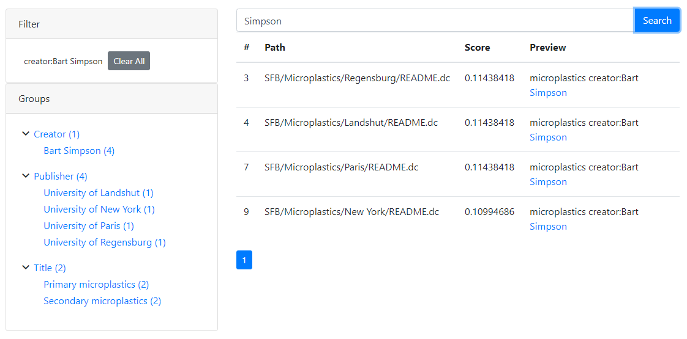

# OC Search Elastic Search UI Prototype
A prototype search dialog built for [oc-search-elastic](https://github.com/BayCEER/oc-search-elastic)

To run the prototype:
 - Start your oc-search-elastic service 
 - Adapt the `indexHost` and `indexCollection` setting in file [Index.js](src/index.js) 
 - Build and run the app: `npm start`
 - Open chrome and install the [CORS extension](https://chrome.google.com/webstore/detail/allow-cors-access-control/lhobafahddgcelffkeicbaginigeejlf)
 - Open [http://localhost:3000](http://localhost:3000) to view the prototype in chrome

 

